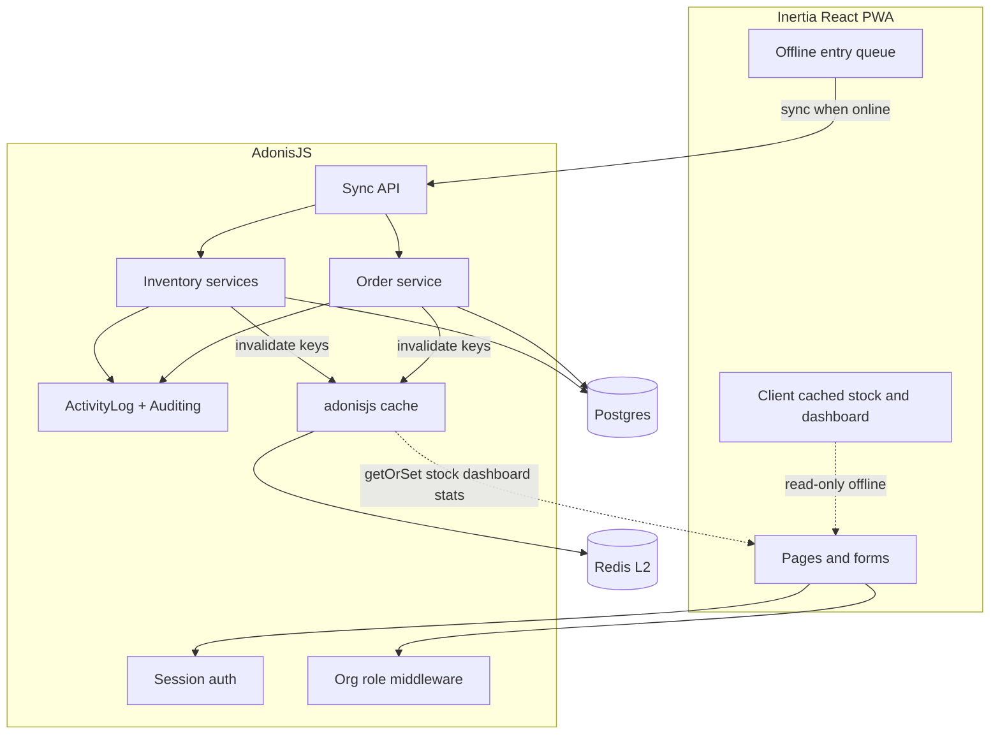

# Farmco Development Plan

## Approach (locked)

- **Product name: Farmco** — replace starter/template and design-guide placeholder “FlockLedger” everywhere users see it (UI copy, titles, PWA manifest, emails, README, package display name). Keep design tokens, egg+leaf mark, and voice from the brand guide.
- **Adapt** the existing AdonisJS 6 + Inertia/React starter: keep auth, sessions, mail, audits, shadcn UI, workspaces.
- **Map** `Workspace` → farm **Organization**; `WorkspaceRole` `owner` / `admin` / `member` → PRD **Owner** / **Manager** / **Worker**.
- **Hide** (do not delete) billing, Stripe UI, blog, and public pricing from nav and product flows.
- **Brand** from [`.cursor/design/poultry-brand-design-guide.html`](.cursor/design/poultry-brand-design-guide.html) applied to [`resources/css/app.css`](resources/css/app.css) and layouts, with **Farmco** as the wordmark.
- **Redis caching** via existing [`@adonisjs/cache`](config/cache.ts) + `@adonisjs/redis` (credentials already in env): L1 memory + L2 Redis for stock snapshots, dashboard, org settings, and stats aggregates; invalidate on every inventory/order mutation.
- **Save** this plan at [`.cursor/plans/farmco-development-plan.md`](.cursor/plans/farmco-development-plan.md) as the first execution step (source of truth for later phases).

## Current baseline

| Keep | Hide / de-emphasize | Build new |
|---|---|---|
| Auth, password reset, sessions, rate limits | Billing, Stripe webhooks UI, Plans | Birds / Eggs / Feed movements + stock |
| Workspace + members + invitations | Blog public + admin | Orders + stock deduction |
| `@stouder-io/adonis-auditing` + audits API | Multi-workspace switcher for day-to-day (one farm) | Dashboard, Stats, Activity log UI |
| `@adonisjs/cache` (today: memory + file L2) | SaaS marketing home/pricing as product | Redis L2 store + domain cache keys |
| shadcn UI, DashboardLayout, Formik/Yup | — | PWA offline queue + sync |
| Japa unit/functional tests | — | Domain + permission + offline + cache tests |

PRD source: [`.cursor/prd/poultry-farm-inventory-prd.md`](.cursor/prd/poultry-farm-inventory-prd.md).

---

## Architecture

### Redis / `@adonisjs/cache` strategy

**Setup (Phase 0b)** — env already has `REDIS_HOST`, `REDIS_PORT`, `REDIS_PASSWORD`:

1. Add `@adonisjs/redis`, configure `config/redis.ts`, register provider in `adonisrc.ts`.
2. Validate Redis env in [`start/env.ts`](start/env.ts); document in `.env.example` (no secrets).
3. Change [`config/cache.ts`](config/cache.ts) default store to L1 memory + L2 Redis (keep `memoryOnly` for tests if Redis is unavailable in CI — use memory-only when `NODE_ENV=test` or `CACHE_STORE=memory`).
4. Optional later: point `LIMITER_STORE` / session at Redis; **not required for v1** (cookie session + DB limiter stay).

**Cache keys** (scoped by `workspaceId` / org):

| Key pattern | TTL | Written / read by | Invalidate when |
|---|---|---|---|
| `org:{id}:stock:birds` | 5 min | Bird service / dashboard | Any bird movement or correction |
| `org:{id}:stock:eggs` | 5 min | Egg service / orders / dashboard | Any egg movement, Sold order, correction |
| `org:{id}:stock:feed` | 5 min | Feed service / dashboard | Any feed movement or correction |
| `org:{id}:dashboard` | 2 min | Dashboard controller | Any stock change, order status change, needs-review change |
| `org:{id}:settings` | 30 min | Org settings | Owner updates eggs-per-crate / low-feed threshold |
| `org:{id}:stats:{range}` | 10 min | Stats service | Any inventory or order mutation (namespace bust) |
| `org:{id}:pending_orders_count` | 2 min | Dashboard / orders | Order create / approve / cancel / sold |

**Rules**

- Postgres remains source of truth; Redis is a read-through cache only.
- Mutations use DB transactions first, then **delete** related keys (do not write stale totals into Redis from the client).
- Prefer `cache.getOrSet` for reads; use a small `FarmCacheService` helper for namespaced delete (`deleteByPrefix` / list of keys).
- Never cache permission decisions or full activity-log pages (filter-heavy, user-scoped).
- Client offline cache (IndexedDB/PWA) is separate from server Redis.

**Role mapping**

| PRD | `workspace_members.role` | Capabilities |
|---|---|---|
| Owner | `owner` | Full; create/deactivate managers + workers; org settings |
| Manager | `admin` | Create/deactivate workers; approve/cancel orders; correct entries |
| Worker | `member` | Record inventory; create Pending orders; limited stats/activity |

Enforce on the **server** (middleware + Vine validators + service checks); UI hides forbidden actions per brand guide.

**Bird stock model (composite dimensions)**  
Chicks are a production bucket. Adults have `health` (`well`|`sick`) × `production` (`laying`|`non_laying`). Movements are append-only; current stock is maintained transactionally and always reconcilable from records.

---

## Phase 0 — Plan artifact and product shell

1. Write [`.cursor/plans/farmco-development-plan.md`](.cursor/plans/farmco-development-plan.md) (this plan + checklists).
2. Apply brand-guide tokens in [`resources/css/app.css`](resources/css/app.css): Field Green, Yolk, Eggshell, Barn Ink, Brick, Sky; Fraunces (headings/stats) + Inter (body); light/dark; radius `field`/`card`.
3. Rename product to **Farmco**: logo/favicon (egg+leaf + “Farmco” wordmark), document titles, auth/marketing copy, email from-name where applicable, PWA `name`/`short_name`, `package.json` `name` if still the starter slug.
4. Hide billing/blog/pricing from [`inertia/components/dashboard/sidebar.tsx`](inertia/components/dashboard/sidebar.tsx), public nav, and routes still reachable only if bookmarked (optional redirect later).
5. Mobile bottom nav: Dashboard, Birds, Eggs, Feed, Orders; desktop sidebar adds Stats, Users, Activity, Settings (owner).
6. Soften multi-workspace: onboarding creates the single org; keep invitations for staff; hide workspace switcher when only one workspace exists.

**Done when:** App boots as Farmco with new theme; no FlockLedger/starter branding in UI; SaaS clutter gone from primary nav; nav matches design guide.

---

## Phase 0b — Redis cache wiring

1. Install and configure `@adonisjs/redis`; wire L2 Redis in [`config/cache.ts`](config/cache.ts).
2. Add `FarmCacheService` (getOrSet + invalidate org namespaces).
3. Health check: Redis ping in `/health` or startup log (fail soft in dev with warning if Redis down; use memory fallback only in test).
4. Confirm connection against configured `REDIS_*` env vars.

**Done when:** `cache.get`/`set` round-trips through Redis in development; tests can run without Redis via memory store.

---

## Phase 1 — Auth, org roles, user management

1. Extend org settings on `workspaces` (or `workspace_settings` JSON): `eggs_per_crate` (default 30), `low_feed_threshold`.
2. Invite / create users with role rules: Owner → manager|worker; Manager → worker only; reject manager-create-manager (UI + API).
3. Temporary password or invite link; force password change on first login.
4. Deactivate (soft): `status` active/inactive; blocked at login; historical attribution preserved.
5. Permission helpers: `canManageManagers`, `canApproveOrders`, `canCorrectEntries`, etc.
6. Owner-only organization settings page.

**Tests:** see Test Suite A below.

---

## Phase 2 — Inventory core (MVP)

### Data

Migrations + Lucid models:

- `bird_stocks`, `bird_records` (add/remove/move, reason, note, `client_entry_id`, `recorded_at`, `user_id`, `needs_review`)
- `egg_stocks` (size: small|medium|large; eggs count; derive crates + loose), `egg_records`
- `feed_stocks` (bags decimal), `feed_records`
- `activity_logs` (user, action, entity, before/after, quantity, note, timestamp) — domain trail complementary to package audits

### Services (transactional)

- `BirdInventoryService`, `EggInventoryService`, `FeedInventoryService`
- Rules: no negative stock; reason required on remove; move updates two buckets; every mutation writes ActivityLog
- After successful commit: invalidate `stock:*`, `dashboard`, `stats:*`, and related counters via `FarmCacheService`
- Stock reads for UI: `getOrSet` from Redis with short TTL

### UI

- Birds / Eggs / Feed pages: current counts, recent movements, large mobile forms (add / remove / move)
- Quick actions on dashboard: Record eggs, Record feed, Add bird update

**Tests:** Suite B (+ cache invalidation cases in Suite H).

---

## Phase 3 — Dashboard and activity log (MVP)

1. Replace stub [`inertia/pages/dashboard.tsx`](inertia/pages/dashboard.tsx) with live totals (from Redis-backed stock keys), pending orders count (placeholder 0 until Phase 4), low-feed alert, needs-review alerts.
2. Cache composed `org:{id}:dashboard` payload; bust on any contributing mutation.
3. Activity log page: Owner/Manager filter by user/type/date; Worker sees own entries only; immutable UI (not Redis-cached).
4. Wire existing audits where useful for user/settings changes.

**Tests:** Suite C.

---

## Phase 4 — Orders (v1.0)

1. Models: `orders`, `order_items` (size, crates); statuses Pending → Approved → Sold | Cancelled.
2. Create order: all roles; always Pending for workers.
3. Approve / Cancel / Mark Sold: Owner + Manager only; Sold deducts egg stock in one transaction; insufficient stock blocks with shortfall message.
4. List filters: status, date range, customer; search customer/order ID.
5. Offline: create Pending only; Sold/Cancel require online.

**Tests:** Suite D.

---

## Phase 5 — Statistics (v1.0)

1. Stats page (Owner/Manager full; Worker limited: own activity + basic totals).
2. Metrics: bird totals/trends/mortality; egg production by size/laying rate/spoilage; feed usage/days left/per bird; orders by status/crates sold/fulfilment; entries per user (Owner/Manager).
3. Date range: 7d / 30d / custom. Charts: green primary, yolk comparison, brick for problems.
4. Cache aggregates under `org:{id}:stats:{range}`; invalidate entire stats namespace on inventory/order writes (acceptable for single-farm write volume).

**Tests:** Suite E.

---

## Phase 6 — Offline PWA and sync (MVP + v1.0 conflicts)

1. Web app manifest + service worker (cache shell + last dashboard/stock/orders).
2. IndexedDB queue for bird/egg/feed entries and Pending orders; stamp `recorded_at` and `client_entry_id` at capture time.
3. Sync API: idempotent by `client_entry_id`; apply as movements; never silent drop.
4. Status badge: Online / Offline / N waiting; Sync now; warn on logout with pending queue.
5. Conflict: removal that would go negative → save + `needs_review`; dashboard alert; Owner/Manager accept/correct/reject.
6. Deactivated-while-offline: accept queued entries as pre-deactivation.

**Tests:** Suite F (API + documented manual device checks).

---

## Phase 7 — Corrections, polish, NFR

1. Owner/Manager edit/correct past inventory entries with required reason; log keeps original + correction.
2. Confirmations for destructive actions; calm error copy per brand voice.
3. Performance pass (mobile, &lt;3s target) with Redis warm vs cold; session timeout; HTTPS/rate-limit already present.
4. Seed farm demo data for local/demo.
5. Update README for Farmco setup (Postgres, Redis, migrate, seed, PWA notes).

**Tests:** Suites G–H + full checklist.

---

## File touchpoints (expected)

| Area | Paths |
|---|---|
| Theme | `resources/css/app.css`, layout fonts |
| Nav | `inertia/components/dashboard/sidebar.tsx`, new mobile bottom nav |
| Cache | `config/cache.ts`, `config/redis.ts`, `app/services/farm_cache_service.ts`, `start/env.ts` |
| Domain | `app/models/*`, `database/migrations/*`, `app/services/*` |
| HTTP | `app/controllers/*`, `start/routes.ts`, Vine validators |
| Pages | `inertia/pages/{dashboard,birds,eggs,feed,orders,stats,users,activity,settings}/*` |
| Offline | `inertia/lib/offline/*`, service worker / Vite PWA plugin |
| Tests | `tests/functional/*`, `tests/unit/*` |
| Plan doc | `.cursor/plans/farmco-development-plan.md` |

---

## Test suites

### A — Auth and roles
- Owner creates manager and worker; manager creates worker; manager cannot create manager (403 + UI absent).
- Deactivated user cannot login; past entries still show name.
- Worker cannot open user management or org settings.
- First-login password change required after invite.

### B — Inventory
- Add/remove/move birds; stock never negative; remove without reason fails.
- Eggs: crates + loose math with `eggs_per_crate`; broken/spoiled with reason.
- Feed: fractional bags; low threshold surfaces on dashboard.
- Each mutation creates ActivityLog with user + timestamp.
- Concurrent adds do not overwrite totals (movement-based).

### C — Dashboard / activity
- Dashboard reflects current stock after entries.
- Worker activity filter = own only; Owner sees all + filters.

### D — Orders
- Worker creates Pending only; cannot Sold/Cancel.
- Manager Approves then Sold; egg stock decreases by ordered crates.
- Sold with insufficient stock rejected with shortfall.
- Cancel does not deduct stock.

### E — Statistics
- Mortality and egg production match seeded movements for a date range.
- Worker limited payload; Owner gets per-user activity.

### F — Offline / sync
- POST sync with `client_entry_id` is idempotent.
- Conflicting removal → `needs_review` + dashboard alert.
- Queued entry preserves original `recorded_at`.
- Manual: install PWA, airplane mode entry, reconnect syncs; kill browser offline — queue survives.

### G — Corrections / security
- Worker cannot correct; Manager corrects with reason; log has both rows.
- All forbidden actions return 403 even if UI bypassed.

### H — Redis / cache
- Stock `getOrSet` returns DB value on cold cache; second read hits cache (assert via spy or TTL behavior).
- After bird/egg/feed mutation, dashboard and stock keys are gone / refreshed with new totals.
- Marking order Sold invalidates egg stock + dashboard + stats keys.
- Org settings update invalidates `org:{id}:settings` and egg crate math on next read.
- Tests run green with `CACHE_STORE=memory` (no Redis required in CI).

Run continuously: `npm run test`, `npm run typecheck`, smoke `npm run dev` on phone-width viewport.

---

## Pre-confirm verification checklist

Use before calling any phase “done” or shipping MVP/v1.0.

### Product / PRD
- [ ] Owner / Manager / Worker matrix matches PRD §2.1 (UI + API)
- [ ] Birds: add, remove (reason), move; categories/dimensions correct; no negative stock
- [ ] Eggs: collect, break/spoil, crates+loose; settings eggs-per-crate
- [ ] Feed: purchase, use; days-left; low-stock alert
- [ ] Orders: create, approve, sold (deduct), cancel; worker restrictions
- [ ] Statistics: all metrics for Owner/Manager; limited for Worker
- [ ] Dashboard: today’s snapshot + quick actions + alerts
- [ ] Activity log: immutable; role-scoped filters
- [ ] Offline: entry + Pending order queue; sync; needs-review; logout warning
- [ ] Billing/blog/pricing not in primary nav or onboarding

### Design / naming
- [ ] Product name is **Farmco** in UI, titles, PWA manifest, and README (no FlockLedger or starter template name)
- [ ] Tokens match brand guide (green/yolk/eggshell; Fraunces + Inter)
- [ ] Touch targets ≥44px; status = color + dot + label
- [ ] Bottom nav on mobile; sidebar on desktop with Stats/Users
- [ ] Light and dark mode readable (WCAG AA body text)
- [ ] Voice: short, calm errors; no jargon

### Engineering
- [ ] Migrations apply clean on fresh DB
- [ ] Redis connected in dev; cache L2 is Redis (not file) for default store
- [ ] Stock/dashboard/stats cache invalidates correctly after mutations
- [ ] Seeded Owner can complete flows 1–5 in PRD §4
- [ ] `npm run test` green; critical Suites A–H covered (tests use memory cache)
- [ ] `npm run typecheck` clean
- [ ] Server enforces permissions (spot-check with Worker session)
- [ ] No secrets committed; README covers Postgres + Redis run steps

### Sign-off
- [ ] Manual walkthrough on a real phone (or DevTools device mode)
- [ ] Plan file at `.cursor/plans/farmco-development-plan.md` updated if scope changed
